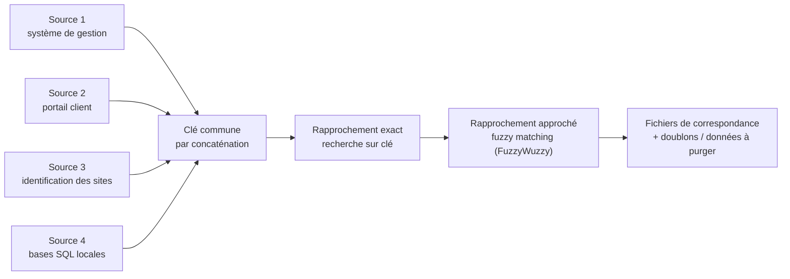

# Réconciliation de données multi-sources & détection des doublons

**Étude de cas (anonymisée) — Data Quality · rapprochement (fuzzy matching) · déduplication**
Jean Lavital — Data Analyst

> Associer des contrats aux dossiers clients à partir de **4 sources hétérogènes**, afin de fiabiliser un système de gestion et d'identifier les données à purger. Un processus auparavant manuel, chronophage et sujet aux erreurs, que j'ai automatisé.

## Chiffres clés

| 4 | ~12 000 | clé composite | 58,3 % |
|---|---|---|---|
| sources à réconcilier | dossiers clients | clé de jointure générée | dossiers rapprochés |

*(Volumes et exemples anonymisés / fictifs.)*

## Contexte et difficulté

Au sein d'une direction Stratégie & Pilotage, l'association des dossiers clients à leurs contrats se faisait **manuellement** — long et source d'erreurs. Première difficulté technique : **aucune clé unique** ne permettait de réconcilier les 4 sources entre elles. Il a donc fallu **construire une clé commune** avant tout rapprochement.

## Démarche

1. **Acquisition** — récupération de 4 exports de sources différentes (système de gestion, portail client, référentiel des sites, consolidation de bases SQL locales).
2. **Analyse des clés de jointure** — constat qu'aucune clé unique ne relie les 4 sources ; identification de champs communs pour générer une **clé unique par concaténation** (N° de contrat, code, préfixe, suffixe).
3. **Nettoyage** — extraction des segments (préfixe/suffixe) et normalisation pour construire la clé à la maille « dossier ».
4. **Réconciliation** — rapprochement **exact** sur la clé commune (premier passage), puis **rapprochement approché par fuzzy matching (FuzzyWuzzy)** pour récupérer les correspondances imparfaites (fautes, variantes de noms de clients/sites).
5. **Restitution** — production de fichiers de correspondance exploitables par les équipes métier.
6. **Interprétation & KPI** — mesure du taux de rapprochement (**58,3 %**) et identification des **doublons / données à purger**.

## Règles de correspondance

| Niveau | Méthode |
|---|---|
| Clé exacte | concaténation N° contrat + code + préfixe + suffixe |
| Approché | fuzzy matching (FuzzyWuzzy) sur noms de clients / sites, villes, codes postaux |
| Fiabilisation | prévention des affectations multiples, détection des doublons |

## Résultats obtenus

- **58,3 % des dossiers rapprochés** automatiquement, contre un traitement auparavant 100 % manuel.
- Identification des **doublons et des données à purger** dans le système de gestion.
- Fichiers de correspondance clairs, réutilisables par les équipes métier.
- Réduction nette du temps et des erreurs par rapport à l'association manuelle.

## Ce que ce cas démontre

Capacité à réconcilier des sources hétérogènes sans clé commune, à concevoir une stratégie de clé de jointure, et à combiner **rapprochement exact et approché (fuzzy)** pour fiabiliser un référentiel — le cœur de la qualité des données.

## Recul technique

Les limites de l'approche (Excel + scripts ponctuels) tiennent au volume et à l'absence d'automatisation. Industrialisée, cette réconciliation gagnerait à être orchestrée (pipeline rejouable, seuils de similarité paramétrables, logs et table de rejets) pour un suivi continu de la qualité.

---

**Compétences démontrées :** Python · FuzzyWuzzy · Excel (RechercheX, fonctions texte, concaténation) · SQL · rapprochement & déduplication · qualité des données

*Étude de cas anonymisée : aucune donnée réelle ni nom de client ou d'entreprise n'y figure ; volumes et exemples fictifs.*
